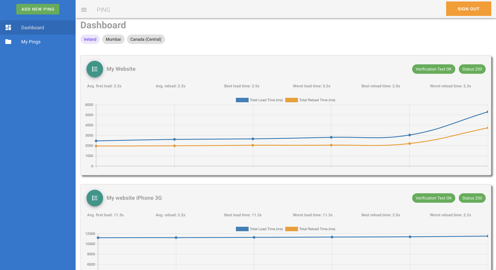
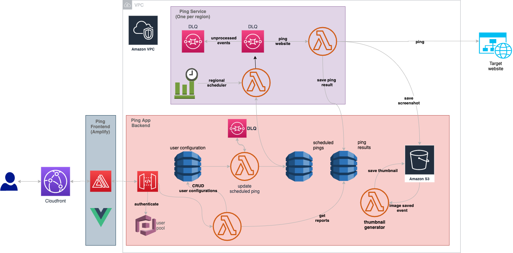

# serverless-site-ping

Ping is a serverless web application that I developed to "ping" a web page from any AWS region in the world and get a screenshot and performance metrics from that location. Users can configure how often a page should be pinged, the device to be emulated (e.g iPhone) and the network conditions (e.g. Good 3G).

I mainly developed it as a hobby but I used it to collect metrics for a performance project I worked in the past.

The application has 3 modules:

### [ping-app-bakcend](https://github.com/fabioandreola/ping-app-backend)

This is the common backend module where data is kept and serves all the front end requests.

### [ping-service](https://github.com/fabioandreola/ping-service)

This is the module responsible to schedule pings in a AWS region and get page metrics, generate HAR file and take a screenshot.  It is meant to be deployed in all regions we want to evaluate a website from. Currently it is configured to be deployed to eu-west-1, ca-central-1 and ap-south-1.

### [ping-frontend](https://github.com/fabioandreola/ping-frontend)

This is the frontend that talks to the `ping-app-backend` and it is written in Vue and hosted in AWS using Amplify.

## App architecture diagram

## CI-CD

Continous integration and delivery is done suing GitHub Actions and Amplify.

##### To call any of the backend endpoints using postman for example exchange the id_token for an AWS SigV4 to call the API Gateway

1. Get an id token from Cognito (Use the Hosted UI undwr App Client Settings)
2. aws cognito-identity get-id --identity-pool <identity pool id> --logins cognito-idp.<region>.amazonaws.com/<user pool id>=<id token>
3. aws  cognito-identity get-credentials-for-identity --identity-id <identity id> --logins cognito-idp.<region>.amazonaws.com/<user pool id>=<id token>
4. Send post request to API Gateway using the AWS SigV4 using the details in step 3